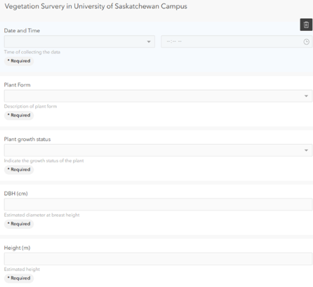

# Vegetation-Survey-of-the-University-of-Saskatchewan-Campus
A project for GIS501 (Introduction to GIS: Geospatial Data-Seneca Polytechnic)
# Vegetation Survey of the University of Saskatchewan Campus

A project completed as part of **GIS501: Introduction to GIS – Geospatial Data**  
Seneca Polytechnic | March 2026  
**Author:** Mohammed

---

## Overview

This project presents the results of a field-based vegetation inventory conducted on the University of Saskatchewan (USask) campus in Saskatoon, Saskatchewan. The survey documented the spatial distribution and physical characteristics of trees and shrubs across the campus, with the goal of supporting environmental monitoring and urban green space understanding.

A total of **25 vegetation sample points** were collected on **March 20, 2026**, consisting of 17 trees and 8 shrubs. Results were visualized and analyzed using ArcGIS Online and communicated through an ArcGIS StoryMap.

---

## Tools and Platform

| Tool | Purpose |
|------|---------|
| ArcGIS Field Maps | Mobile field data collection |
| ArcGIS Field Maps Designer | Field form configuration |
| ArcGIS Online Map Viewer | Spatial analysis and visualization |
| ArcGIS Online Dashboards | Attribute summary and charting |
| ArcGIS StoryMaps | Results communication and documentation |
| Arcade Expression Language | Dynamic labelling in web maps |

---

## Data Collection

The field form was configured in **ArcGIS Field Maps Designer** and captured the following attributes for each sample point:

- **Date and Time** – timestamp of data collection
- **Plant Form** – tree or shrub (dropdown, required)
- **Plant Growth Status** – active growth or dormant (required)
- **Diameter at Breast Height (DBH, cm)** – stem diameter at ~1.3 m
- **Height (m)** – estimated vegetation height (required)
- **Horizontal Accuracy (m)** – GPS positional accuracy at time of collection
- **Photo** – field photograph of each specimen


---

## Analysis

### Positional Accuracy Assessment
A buffer analysis was performed in ArcGIS Online Map Viewer using the **Create Buffers** tool. Each of the 25 sample points was buffered using the recorded horizontal accuracy value to assess GPS precision across the campus.


### Vegetation Characteristics
- **Plant Form Distribution**: 68% trees (17 points), 32% shrubs (8 points)
- 

- **Plant Growth Status**: A significant proportion of vegetation — particularly trees — was still dormant at the time of the March 20 survey, consistent with early growing season conditions in Saskatoon


The following Arcade expression was used in the web map for dynamic label display:

```arcade
$feature["Plant_growth_status"]
" Growth Status: " + DomainName($feature, "Plant_growth_status")
" Horizontal Accuracy: " + $feature["esrignss_h_rms"] + " m"
```

---

## Resources

| Resource | Link |
|----------|------|
| StoryMap | [View StoryMap](https://storymaps.arcgis.com/stories/8b5be77841d4413cac1dffc254921071) |
| Web Map | [View Web Map](https://secetmcs.maps.arcgis.com/home/item.html?id=549a6833d83f4c35b1052310b068ec2d) |
| Data Collection Layer | [Feature Service](https://services7.arcgis.com/AJbWLzAgoYuSYK87/arcgis/rest/services/Vegetation_Survery_in_University_of_Saskatchewan_Campus/FeatureServer) |
| Horizontal Accuracy Buffers Layer | [Feature Service](https://services7.arcgis.com/AJbWLzAgoYuSYK87/arcgis/rest/services/HorizontalAccuracyBuffer/FeatureServer) |
| Authoritative Basemap | [World Imagery (Esri)](https://services.arcgisonline.com/ArcGIS/rest/services/World_Imagery/MapServer) |

---

## References

- University of Saskatchewan, Real Estate and University Lands: https://leadership.usask.ca/administration/real-estate.php
- Patterson Garden Arboretum, USask: https://patterson-arboretum.usask.ca/
- Gardening at USask – Trees and Shrubs: https://gardening.usask.ca/gardening-advice/sorted-by-plant/trees.php
- Course Instructor: Rafik Said, M.Sc., Seneca Polytechnic

---

## License

This project was completed for academic purposes as part of GIS501 at Seneca Polytechnic.
